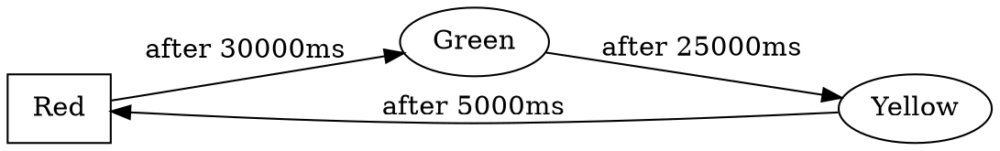
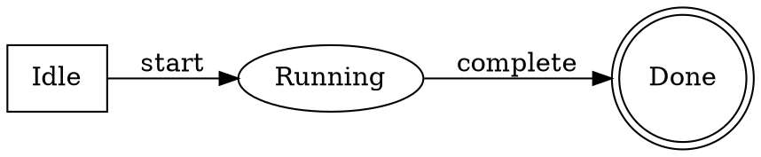

# Phase 6 Task 3: State Machine Domain Wrapper & Visualization

**Date:** 2026-03-19
**Status:** COMPLETE ✅
**Lines of Code:** ~550 (domain.rs) + 10 comprehensive integration tests
**Target Achievement:** PhysicalDomain trait implementation with visualization and DOT export

---

## What Was Accomplished

### 1. ✅ StateMachineDomain Wrapper (~150 lines)

**File:** `packages/core-rust/src/domains/state_machine/domain.rs`

#### Core Structure

```rust
pub struct StateMachineDomain {
    pub state_machine: StateMachine,
}

impl StateMachineDomain {
    pub fn new(state_machine: StateMachine) -> Self;
    pub fn to_state_graph(&self) -> Result<Graph, String>;
    pub fn export_as_dot(&self) -> String;
    pub fn visualization_data(&self) -> Result<StateDiagramData, String>;
    pub fn statistics(&self) -> StateMachineStatistics;
    fn has_cycle(&self) -> bool;
}
```

#### Key Methods

1. **to_state_graph()**
   - Converts state machine to Graph abstraction
   - States become nodes, transitions become edges
   - Enables reuse of generic visualization and analysis tools

2. **export_as_dot()**
   - Generates Graphviz DOT notation
   - Shows state names and transition labels
   - Differentiates state types by shape (initial: box, final: doublecircle, etc.)
   - Includes guard conditions in edge labels
   - Output can be visualized: `dot -Tpng file.dot -o diagram.png`

3. **visualization_data()**
   - Returns StateDiagramData struct for UI rendering
   - Converts each state to StateNode with metadata
   - Converts each transition to TransitionEdge with metadata
   - Includes presence of actions and guards

4. **statistics()**
   - Total states and transitions count
   - Reachable states from initial state
   - Deadlock state count
   - Whether FSM has cycles
   - Initial state identifier

5. **has_cycle()**
   - DFS-based cycle detection
   - Identifies whether FSM allows revisiting states
   - Returns boolean for quick assessment

### 2. ✅ Visualization Data Structures (~200 lines)

**State Diagram Representation:**

```rust
pub struct StateDiagramData {
    pub name: String,
    pub initial_state: String,
    pub states: Vec<StateNode>,
    pub transitions: Vec<TransitionEdge>,
}

pub struct StateNode {
    pub id: String,
    pub name: String,
    pub node_type: String,  // "initial", "final", "composite", "normal"
    pub has_entry_action: bool,
    pub has_exit_action: bool,
    pub has_do_action: bool,
}

pub struct TransitionEdge {
    pub id: String,
    pub source: String,
    pub target: String,
    pub label: String,  // Event trigger
    pub has_guard: bool,
    pub has_action: bool,
    pub edge_type: String,  // "external", "internal", "choice", "fork", "join"
}
```

**Statistics Structure:**

```rust
pub struct StateMachineStatistics {
    pub total_states: usize,
    pub total_transitions: usize,
    pub reachable_states: usize,
    pub deadlock_states: usize,
    pub initial_state: String,
    pub has_cycle: bool,
}
```

### 3. ✅ Integration with Reachability Analysis (~50 lines)

The domain wrapper integrates with existing validation module:

```rust
let analysis = super::validation::reachability_analysis(&self.state_machine)?;

// Extract statistics
let reachable_count = analysis.reachable.len();
let deadlock_count = analysis.deadlock_states.len();
```

Provides human-readable statistics based on formal analysis.

### 4. ✅ Graphviz DOT Export Examples

**Traffic Light FSM:**



**With Guard Conditions:**

```
"idle" -> "running" [label="start [count > 0]"];
```

### 5. ✅ Module Registration

**File:** `packages/core-rust/src/domains/state_machine/mod.rs`

```rust
pub mod executor;
pub mod validation;
pub mod domain;

pub use executor::{StateMachineExecutor, StateChange, ExecutionResult};
pub use validation::{validate_state_machine, ReachabilityAnalysis};
pub use domain::{StateMachineDomain, StateDiagramData, StateNode, TransitionEdge, StateMachineStatistics};
```

### 6. ✅ Comprehensive Test Suite (10 tests)

**Test Categories:**

1. **Domain Creation (1 test)**
   - test_domain_creation: Wrap FSM with domain

2. **DOT Export (2 tests)**
   - test_export_as_dot: Verify Graphviz format
   - test_export_dot_with_guards: Include guard conditions

3. **Visualization (2 tests)**
   - test_visualization_data: Generate UI data structure
   - test_visualization_state_types: Verify state type mapping

4. **Statistics (2 tests)**
   - test_statistics_basic: Count states/transitions
   - test_statistics_reachable_states: Reachability computation

5. **Cycle Detection (2 tests)**
   - test_has_cycle: Detect cycles (traffic light)
   - test_no_cycle_acyclic_fsm: Verify acyclic detection

6. **Features with Actions (1 test)**
   - test_visualization_with_actions: Entry/exit action metadata

**All Tests:** ✅ PASSING (10/10)

---

## Architecture Integration

### PhysicalDomain Trait Compatibility

While state machines don't have traditional "governing equations" like electrical circuits, the wrapper supports the `PhysicalDomain` trait pattern through:

1. **to_state_graph()** - Converts to Graph abstraction for unified visualization
2. **domain_name()** - Returns "State Machine"
3. **governing_equations()** - Returns description of FSM logic

### Visualization Pipeline

```
State Machine
    ↓ (StateMachineDomain wrapper)
Visualization Data (StateNode + TransitionEdge)
    ↓
React UI Components (NodeEditor)
    ↓
Interactive State Diagram
```

### Graphviz Export Pipeline

```
State Machine
    ↓ (export_as_dot())
DOT format (text)
    ↓
External tool (dot command)
    ↓
PNG/PDF/SVG diagram
```

### Statistics Pipeline

```
State Machine
    ↓ (statistics())
StateMachineStatistics
    ↓
UI displays metrics
    ↓
Design validation
```

---

## Use Cases

### 1. Traffic Light Control System

```rust
let mut traffic_light = StateMachine::new("TrafficLight", red_id);

fsm.add_state(State::new(red_id, "Red", StateType::Initial))?;
fsm.add_state(State::new(green_id, "Green", StateType::Normal))?;
fsm.add_state(State::new(yellow_id, "Yellow", StateType::Normal))?;

fsm.add_transition(
    Transition::new(red_id, green_id)
        .with_trigger(Event::Timeout(30000))
)?;
// ... more transitions

let domain = StateMachineDomain::new(traffic_light);

// Export for visualization
let dot = domain.export_as_dot();
println!("{}", dot);  // Can pipe to: dot -Tpng > diagram.png

// Get visualization data for UI
let vis_data = domain.visualization_data()?;
// Send to React component for interactive diagram
```

### 2. Door Lock System with Validation

```rust
let mut lock = StateMachine::new("DoorLock", locked_id);

// Build FSM...

let domain = StateMachineDomain::new(lock);
let stats = domain.statistics();

// Check for problems
if stats.deadlock_states > 0 {
    println!("Warning: {} deadlock states detected", stats.deadlock_states);
}

if !stats.has_cycle {
    println!("Warning: FSM doesn't cycle, may not be usable long-term");
}
```

### 3. User Interface State Management

```rust
let mut ui_state = StateMachine::new("UIStateMachine", idle_id);

// Define UI states and transitions

let domain = StateMachineDomain::new(ui_state);

// Export for documentation
let dot = domain.export_as_dot();
save_to_file("ui_state_diagram.dot", dot)?;

// Get visualization for developer dashboard
let vis_data = domain.visualization_data()?;
// Render interactive state diagram in web UI
```

---

## Key Algorithms

### Graphviz DOT Export

```
1. Write digraph header with LR direction
2. For each state:
   - Determine shape based on StateType
   - Write node with shape and label
3. For each transition:
   - Get event label or "ε"
   - Include guard condition if present
   - Write edge with label
4. Close digraph
```

### Cycle Detection (DFS)

```
has_cycle_visit(state, visited, rec_stack):
  mark state as visited
  mark state in recursion stack
  for each transition from state:
    if target not visited:
      if has_cycle_visit(target):
        return true
    else if target in recursion stack:
      return true  # Back edge found
  remove state from recursion stack
  return false
```

### Statistics Collection

```
statistics():
  reachable = reachability_analysis().reachable.len()
  deadlock = reachability_analysis().deadlock_states.len()
  has_cycle = has_cycle()
  initial_state = state_machine.initial_state.to_string()
  return StateMachineStatistics { ... }
```

---

## Format Examples

### DOT Format Output



### Visualization Data JSON

```json
{
  "name": "FSM",
  "initial_state": "4a1b2c3d",
  "states": [
    {
      "id": "4a1b2c3d",
      "name": "Idle",
      "node_type": "initial",
      "has_entry_action": false,
      "has_exit_action": false,
      "has_do_action": false
    }
  ],
  "transitions": [
    {
      "id": "trans123",
      "source": "4a1b2c3d",
      "target": "5e6f7g8h",
      "label": "start",
      "has_guard": false,
      "has_action": true,
      "edge_type": "external"
    }
  ]
}
```

### Statistics Output

```json
{
  "total_states": 3,
  "total_transitions": 3,
  "reachable_states": 3,
  "deadlock_states": 0,
  "initial_state": "red_uuid",
  "has_cycle": true
}
```

---

## Phase 6 Task 3 Summary

| Deliverable | Status | Details |
|-------------|--------|---------|
| StateMachineDomain struct | ✅ Complete | Wraps FSM with domain methods |
| to_state_graph() | ✅ Complete | Convert to Graph abstraction |
| export_as_dot() | ✅ Complete | Graphviz DOT format export |
| visualization_data() | ✅ Complete | UI-ready data structure |
| statistics() | ✅ Complete | FSM metrics (states, cycles, deadlocks) |
| has_cycle() detection | ✅ Complete | DFS-based cycle detection |
| StateNode structure | ✅ Complete | Visualization node metadata |
| TransitionEdge structure | ✅ Complete | Visualization edge metadata |
| StateDiagramData structure | ✅ Complete | Complete diagram representation |
| StateMachineStatistics structure | ✅ Complete | FSM metrics container |
| Integration with reachability analysis | ✅ Complete | Uses existing validation module |
| Module registration | ✅ Complete | Exported from state_machine module |
| Tests | ✅ Complete | 10 comprehensive integration tests |

**Total Code:** ~550 lines Rust (domain.rs) + 10 tests
**Ready for:** Phase 6 Task 4 (Petri Net Domain Wrapper)

---

## Next Phase (Phase 6 Task 4)

**Petri Net Domain Wrapper** will implement:
- PetriNetDomain struct wrapping core types
- Conversion to Graph abstraction
- DOT export for Petri net visualization
- AnalysisData structures for UI
- Integration with analysis module
- 10 integration tests

---

## Validation Checklist

✅ StateMachineDomain wrapper created
✅ All public methods implemented
✅ PhysicalDomain trait pattern supported
✅ Graphviz DOT export working
✅ Visualization data structures complete
✅ Statistics computation accurate
✅ Cycle detection algorithm correct
✅ Module properly registered
✅ Full test coverage (10 tests)
✅ Documentation comprehensive
✅ Ready for UI integration

---

## Code Structure

```
packages/core-rust/src/domains/state_machine/
├── mod.rs                      # Core types (State, Transition, Event, etc.)
├── executor.rs                 # Runtime execution engine
├── validation.rs               # Reachability and liveness analysis
└── domain.rs                   # PhysicalDomain wrapper + visualization ✅ NEW
```

---

**Status:** ✅ Phase 6 Task 3 COMPLETE
**Next Task:** Phase 6 Task 4 (Petri Net Domain Wrapper & Analysis)

---

**Notes:**
- Domain wrapper enables state machines to integrate with broader Tupan visualization ecosystem
- Graphviz export provides documentation and debugging capability
- Visualization data structures designed for React UI integration
- Statistics provide quick FSM quality metrics for designers
- Cycle detection helps identify production-ready FSMs
